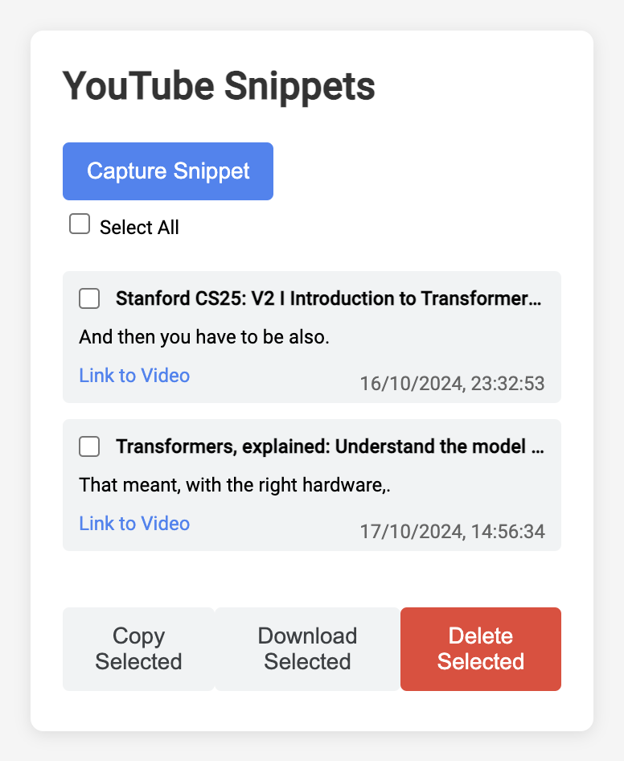

#  YouTube Snippets

> A chrome extension that allows capturing snippets from YouTube videos

Here is a demo: [link to YouTube video]()

## Highlights 🔥
 - Allows to capture snapshots from YouTube. Each snapshot contains:
   - The timestamp at which the snapshot was captured
   - The title of the video
   - The link to the video at that timestamp
   - A brief snippet from the subtitles at that snapshot (when enabled/available)
 - Export snapshots to a text file
 - Copy the snapshots to the clipboard for use in other applications

Here is a sample of how it looks:\

Installation instructions
-
To use this extension:
1. Create a new directory and save these files in it.
2. Create an images folder and add your logo images.
3. Open Chrome and go to chrome://extensions/.
4. Enable "Developer mode" in the top right corner.
5. Click "Load unpacked" and select the directory containing your extension files.

The extension should now be installed and ready to use on YouTube videos.

How to build this extension in under 30 mins with no experience?
- 
The chrome extension in the directory  - [youtube-snippets-v4](youtube-snippets-v4) was generated using [Perplexity's](www.perplexity.ai) LLM, using the free version. I manually fine-tuned the code a bit, but having no experience with front end development and to be able to build simple applications is awesome.

To give you an idea, I have used the following queries in the order specified and built my code:
- **Query 1**\
Write a Chrome extension that works with YouTube videos. The extension should capture the following four things: 
  - Add a title of the video (in bold) 
  - Create a small note of 2-3 sentences by copying text from the subtitles, more precisely from 10 seconds before the current timestamp and 5 seconds afterwards. In case, the subtitles are not enabled / not present, do not raise an error. Simply add the text: "subtitles missing/disabled" and capture the snippet.
  - It should add a link to the YouTube video 10 seconds before the current timestamp. 
  - It should include the current date and time at which the snip was captured. (This can be placed at the bottom right of each snip)

  Allow the user to select individual notes / provide an option to select all the notes. Based on the user’s selection, allow the user to do the following:
  - Copy the selected notes to the clipboard
  - Download the selected notes as a text file
  - Delete the selected notes

  Please note that, if the user clicks on any of the above three actions when none of the notes are selected, please display an appropriate error message.

  Make sure the extension follows Manifest V3 guidelines - https://developer.chrome.com/docs/extensions/develop/migrate/mv2-deprecation-timeline. 

  Name this extension "YouTube snippets". Add an appropriate logo. The pop-up should look modern, make sure to good design principles and CSS.

- **Query 2**\
Please modify this extension so that title of each video appears on the right of each checkbox. Please show only modifications.

- **Query 3**\
Please modify this extension, and add the feature so that all the notes can be selected / deselected with a single click.

- **Query 4**\
The select all functionality does not work well with copy and download buttons. Please fix them as well.

- **Query 5**\
Modify this extension so that successful messages are highlighted in green warnings are highlighted in orange and errors in red. Follow the guide which matches current CSS

- **Query 6**\
In response.js when a snippet is saved successfully, instead of showing an alert with "Snippet saved successfully!", please show the same as a success message.

- **Query 7**\
With the above change the snippets list is not refreshed automatically, whenever a new snippet is added. Please fix this.

You are done! As you would have noticed at each stage, I had tested the application and looked to correct the errors. Of course this may not be an ideal application, but this can be super useful to get you going and build end-to-end applications!

I have generated the *application icon* using Adobe Illustrator - It's not ideal, but I am happy with the result for this fun project.
