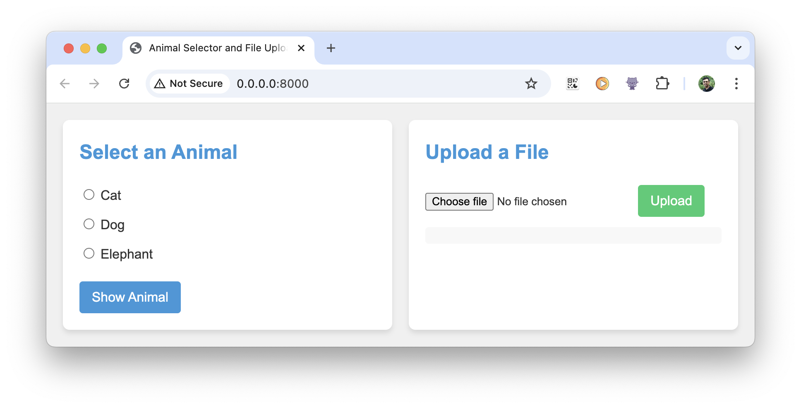

# A basic WebServer with FastAPI

> A FastAPI based webserver with HTTP request and response. This is like a Hello World program.

Here is a demo: [link to YouTube video]()

## Highlights 🔥
 - The frontend is implemented using HTML, CSS, and JavaScript files which has two boxes:
   - One box to select one of the 3 check-boxes (cat, dog, elephant)
   - One box to upload any file
 - Implements the following functionality:
   - If one selects cat or dog or elephant in the first box, then show a photo of cat, dog, or elephant (which is locally stored)
   - If one uploads any file, then we respond back with its name, file-size, and type
 - FastAPI is used to create python-based webserver

Here is a sample of how it looks:\

Installation instructions
-
To run this server:
1. Create a python virtual environment with [requirements.txt](./requirements.txt), and activate it.
2. Run `python main.py` and make sure the webserver is running from the logs.
3. Open any browser and go to [http://0.0.0.0:8000](http://0.0.0.0:8000).
4. Interact with the application in the browser

The webserver should now be running and is ready serve requests.

How to build this web-server in under 30 mins with no experience?
- 
The webserver in this directory was generated using [Perplexity's](www.perplexity.ai) LLM, using the free version. I didn't have to fine-tune any code. Considering, I am just getting started with front end development and using webserver, getting an end-to-end working web-application is awesome. 

To give you an idea, I have used the following queries in the order specified and built my code:
- **Query 1**\
Create separate HTML, CSS, and JS files for a front end which has 2 boxes.
  - one box to select one of the 3 check-boxes (cat, dog, elephant)
  - one box to upload any file
  
  If one selects cat or dog or elephant in the first box, then show a photo of cat, dog, or elephant (you can store this locally as well). 
  
  If one uploads any file, then respond back with its name, file-size, and type
  
  Use FastAPI as the backend to achieve this

- **Query 2**\
Can you show the directory structure?

- **Query 3**\
Rewrite the project structure including the static folder. Also regenerate the code accordingly with modern UI elements.

- **Query 4**\
can you regenerate the code for the above webserver by keeping all files local including CSS but keep it modern

You are done! As you would have noticed at each stage, I had tested the application and looked to refine the results. I wanted a simple yet complete application.  It is best if you go over each file and atleast try to understand syntax. This will help you to understand what is generated. 

>**Here is a tip** - *Once you have the working application, ask the LLM to explain each and every line of the generated code. This will help you to quickly gain more understanding into the working of your application. See the query below.*

- **Query 5**\
I am a beginer to Java Script. Can you explain in detail what each line does in the `script.js` file generated above?

